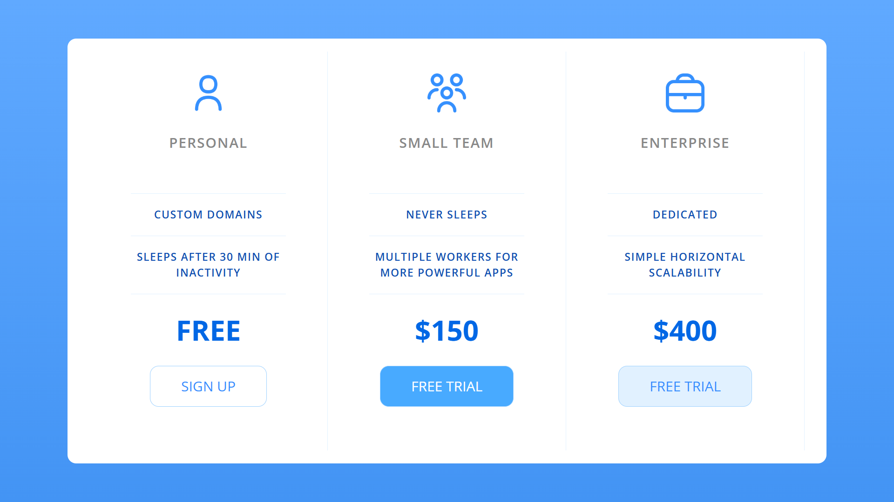

# Table Pricing Plan

This project is a simple HTML and CSS implementation of a pricing table for different plans: Personal, Small Team, and Enterprise.

## Project Structure

- `index.html`: The main HTML file that contains the structure of the pricing table.
- `app.css`: The CSS file that styles the pricing table.
- `icons/`: A directory containing the icons used in the pricing plans.

## Usage

1. Clone the repository or download the project files.
2. Open `index.html` in your web browser to view the pricing table.

## Dependencies

- [Google Fonts - Open Sans](https://fonts.googleapis.com/css?family=Open+Sans:400,600,700)

## Screenshots

## License

This project is licensed under the MIT License.
